# Network Forensics and Attack Analysis Using Wireshark

## Cenário
Num cenário de mundo real, um administrador de rede utiliza o Wireshark para monitorizar o tráfego e deteta sinalização suspeita de *TCP flags* (padrão *Christmas Tree*), indicando um potencial *scan* ou reconhecimento. Observam-se também múltiplas consultas DNS a domínios desconhecidos, sugerindo uma infeção por *botnet*. Utilizando registos de chaves SSL, o tráfego encriptado é desencriptado, revelando um ataque de força bruta a um servidor FTP. A análise aprofundada revela ainda ataques de negação de serviço (DoS) do tipo *ICMP flood* e *SYN flood*, comprometendo a disponibilidade da rede. 

Através da análise de pacotes e da aplicação de filtros no Wireshark, o objetivo é detetar rapidamente os padrões de ataque, isolar os sistemas afetados e aplicar contramedidas adequadas para restaurar a segurança e o desempenho da rede.

## Objetivo
Realizar a análise de tráfego de rede e detetar várias atividades maliciosas e ataques utilizando o Wireshark e ferramentas complementares.

## Ferramentas Utilizadas
* Wireshark & Tshark
* Hping3
* Metasploit Framework
* NetworkMiner
* Hydra
* Nmap
* XSLT (xsltproc)

## Tarefas do Laboratório

1. [Exercise 01: Capture Traffic of a Particular Host](#exercise-01-capture-traffic-of-a-particular-host)
2. [Exercise 02: Analyze and Identify the Christmas Tree Pattern in TCP Flags](#exercise-02-analyze-and-identify-the-christmas-tree-pattern-in-tcp-flags)
3. [Exercise 03: Decrypting TLS Traffic Using Wireshark and SSL Key Log Files](#exercise-03-decrypting-tls-traffic-using-wireshark-and-ssl-key-log-files)
4. [Exercise 04: Converting and Analyzing Packet Captures Using Tshark and XSLT](#exercise-04-converting-and-analyzing-packet-captures-using-tshark-and-xslt)
5. [Exercise 05: Performing and Analyzing ICMP Flood Attacks Using Hping3 and Wireshark](#exercise-05-performing-and-analyzing-icmp-flood-attacks-using-hping3-and-wireshark)
6. [Exercise 06: Demonstrating MAC Flooding and Packet Analysis with Wireshark](#exercise-06-demonstrating-mac-flooding-and-packet-analysis-with-wireshark)
7. [Exercise 07: ARP Poisoning and Traffic Interception with Metasploit and Wireshark](#exercise-07-arp-poisoning-and-traffic-interception-with-metasploit-and-wireshark)
8. [Exercise 08: Analyzing Tor Network Traffic Using Wireshark and NetworkMiner](#exercise-08-analyzing-tor-network-traffic-using-wireshark-and-networkminer)
9. [Exercise 09: Analyzing FTP Brute-Force Attacks using Wireshark](#exercise-09-analyzing-ftp-brute-force-attacks-using-wireshark)
10. [Exercise 10: Analyzing Suspicious Network Traffic for Malicious Activity with Wireshark](#exercise-10-analyzing-suspicious-network-traffic-for-malicious-activity-with-wireshark)
11. [Exercise 11: Conducting and Analyzing SYN Flood DOS Attack with Wireshark](#exercise-11-conducting-and-analyzing-syn-flood-dos-attack-with-wireshark)
12. [Exercise 12: Detecting Botnet Activity Using Wireshark](#exercise-12-detecting-botnet-activity-using-wireshark)

---

## Exercise 01: Capture Traffic of a Particular Host

### Cenário
Na análise de redes, a captura de tráfego de um *host* específico é fundamental para *troubleshooting*, auditorias de segurança e monitorização de desempenho. A filtragem direcionada permite identificar rapidamente problemas de latência, perda de pacotes ou comunicações não autorizadas, isolando o tráfego de origens ou destinos suspeitos.

### Objetivo
Configurar e utilizar **Capture Filters** no Wireshark para capturar e analisar exclusivamente o tráfego de rede associado a um endereço IP específico.

### Metodologia e Execução

1. **Configuração do Filtro de Captura:**
   * No Wireshark, acedeu-se ao menu `Capture` > `Capture Filters`.
   * Criou-se um filtro com a expressão `host 10.10.1.9`.
   * *Nota Técnica:* Os *Capture Filters* (baseados em BPF - *Berkeley Packet Filter*) descartam o tráfego não correspondente logo na interface de rede, poupando recursos e espaço em disco.

2. **Início da Captura:**
   * Selecionou-se a interface `eth0`.
   * Aplicou-se o filtro `host 10.10.1.9` e iniciou-se o processo (*sniffing*).

3. **Validação do Filtro (Tráfego Excluído):**
   * A partir do terminal, executou-se um ping para um endereço diferente: `ping 10.10.1.19`.
   * **Resultado:** Nenhum pacote foi registado, comprovando a atuação correta do filtro.

4. **Validação do Filtro (Tráfego Capturado):**
   * Executou-se o comando `ping 10.10.1.9`.
   * **Resultado:** O Wireshark registou os pacotes (ICMP Echo Request e Echo Reply). 

### Análise e Conclusão
Ao observar os pacotes recolhidos, verificou-se que todos possuíam o endereço `10.10.1.9` no campo **Source** ou **Destination**, ou no próprio payload (como nos pedidos ARP). Isto demonstra a eficácia do parâmetro `host` na sintaxe de captura, garantindo que apenas o tráfego bidirecional de e para o alvo específico é registado na interface `eth0`.

---

## Exercise 02: Analyze and Identify the Christmas Tree Pattern in TCP Flags

### Cenário
O padrão "Christmas Tree" (Árvore de Natal) ocorre quando múltiplas *flags* (nomeadamente URG, PSH e FIN) são ativadas simultaneamente num único pacote TCP. Este tipo de pacote é frequentemente utilizado em técnicas de *stealth scanning* (por exemplo, através do Nmap) para identificar portas abertas ou contornar *firewalls*.

### Objetivo
Analisar os cabeçalhos TCP e identificar o padrão *Christmas Tree* em pacotes capturados utilizando o Wireshark.

### Metodologia e Execução

1. **Preparação da Captura:**
   * Na máquina Windows (alvo), iniciou-se o Wireshark na interface `Ethernet 2`.

2. **Execução do *Scanning* (Reconhecimento):**
   * A partir da máquina atacante (Kali Linux), executou-se um *scan* utilizando o Nmap com o parâmetro `-sX` (*Xmas scan*).
   * Comando utilizado: `sudo nmap -sX 10.10.1.15`

3. **Análise de Tráfego e Identificação de Assinaturas:**
   * Identificaram-se pacotes com as *flags* `FIN, PSH, URG` ativadas em simultâneo.
   * No painel de detalhes do Wireshark, expandiu-se a secção `Transmission Control Protocol` > `Flags`, confirmando visualmente a anomalia.

### Análise e Conclusão
A captura demonstrou claramente a assinatura de tráfego de um *Xmas scan* gerado pelo Nmap. Uma vez que a combinação das *flags* URG, PSH e FIN num único pacote não obedece ao fluxo normal de estabelecimento ou término de uma ligação TCP (segundo a RFC 793), o pacote é considerado anómalo. 

Na imagem abaixo, é possível observar o tráfego gerado pela máquina origem (`10.10.1.13`) para o alvo (`10.10.1.15`), com o painel de detalhes a confirmar a ativação simultânea das flags *Urgent*, *Push* e *Fin*.

---

## Exercise 03: Decrypting TLS Traffic Using Wireshark and SSL Key Log Files

### Cenário
A encriptação TLS é fundamental para garantir a privacidade das comunicações. No entanto, em cenários de análise forense, é frequentemente necessário inspecionar o conteúdo dos pacotes. Ao aproveitar a variável de ambiente `SSLKEYLOGFILE`, é possível configurar o Wireshark para desencriptar o tráfego TLS capturado, revelando cabeçalhos HTTP, *cookies* e outros dados sensíveis.

### Objetivo
Desencriptar tráfego TLS no Wireshark, utilizando um ficheiro de registo de chaves SSL (*SSL key log file*), para capturar e analisar comunicações seguras.

### Metodologia e Execução

1. **Validação das Variáveis de Ambiente:**
   * Na máquina Windows, confirmou-se a existência da variável `SSLKEYLOGFILE`, que regista as chaves criptográficas geradas pelas aplicações locais.

2. **Configuração do Wireshark para Decifragem TLS:**
   * Acedeu-se ao menu `Edit` > `Preferences` > `Protocols` > `TLS`.
   * No campo `(Pre)-Master-Secret log filename`, carregou-se o ficheiro `sslkeylogfile.log`.

3. **Geração e Análise do Tráfego:**
   * Capturou-se tráfego HTTPS real (navegação para `linkedin.com`).
   * Aplicou-se o filtro `tcp` para localizar a comunicação cliente-servidor (TLSv1.3).
   * Ao selecionar o separador **Decrypted TLS** no painel inferior de bytes, foi possível observar o conteúdo original do tráfego web perfeitamente legível em texto limpo.

### Análise e Conclusão
A configuração provou que o tráfego TLS pode ser inspecionado passivamente se as chaves de sessão (*Pre-Master Secrets*) forem registadas pela máquina cliente. Este método é valioso para auditar a segurança de aplicações web e realizar análises forenses de rede sem recorrer a técnicas ativas de MitM. 

Na imagem abaixo, é possível verificar o sucesso da configuração: ao selecionar um pacote TLSv1.3, o Wireshark apresenta o separador **Decrypted TLS**, revelando os detalhes que, de outra forma, permaneceriam ilegíveis.

---

## Exercise 04: Converting and Analyzing Packet Captures Using Tshark and XSLT

### Cenário
Os ficheiros de captura de pacotes podem ser convertidos num formato mais universal e legível utilizando XSLT (Extensible Stylesheet Language Transformations) para transformar dados XML em HTML. Ao combinar o Tshark para extração de dados com o `xsltproc` para formatação, os analistas conseguem criar relatórios estáticos para documentação de incidentes.

### Objetivo
Demonstrar a conversão de ficheiros de captura (PCAP) para HTML e analisar os detalhes utilizando o Tshark e XSLT.

### Metodologia e Execução

1. **Extração de Dados com o Tshark (PCAP para XML):**
   * No terminal, executou-se o comando: `tshark -r 'images.pcap' -T pdml > packets.xml`
   * O parâmetro `-T pdml` exporta o dicionário completo de dissecação dos pacotes no formato PDML (baseado em XML).

2. **Transformação do Formato (XML para HTML):**
   * Executou-se o comando: `xsltproc /usr/share/doc/wireshark/pdml2html.xsl.gz packets.xml > packets.html`

3. **Análise do Relatório Estático:**
   * Abriu-se o ficheiro gerado (`packets.html`) através do Firefox.
   * Verificou-se que a página web reproduz as *frames* dos pacotes de forma estruturada, permitindo investigar detalhes de protocolo.

### Análise e Conclusão
A conversão de capturas utilizando Tshark e XSLT provou ser altamente eficiente para compilar relatórios que podem ser lidos num simples *browser*, facilitando a revisão de incidentes e eliminando a dependência da interface gráfica do Wireshark.

Na imagem abaixo, é possível visualizar o relatório HTML gerado. A expansão da *Frame 2* revela os detalhes granulares do pacote ARP, demonstrando a eficácia desta abordagem analítica - frequentemente apelidada de "poor man's Wireshark".

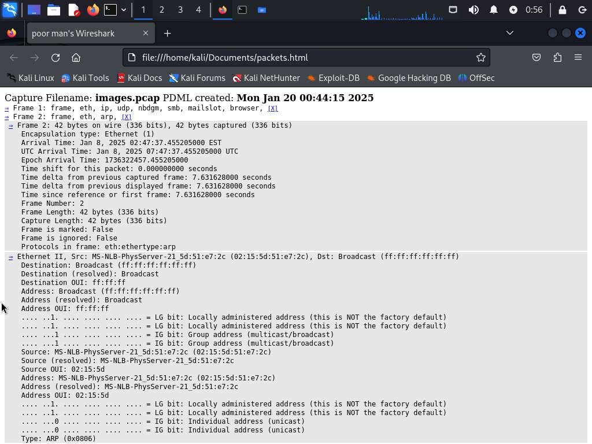

---

## Exercise 05: Performing and Analyzing ICMP Flood Attacks Using Hping3 and Wireshark

### Cenário
O *ICMP flooding* é um ataque DoS onde o atacante sobrecarrega o sistema alvo enviando uma quantidade massiva de pacotes *ICMP Echo Request*. Utilizando ferramentas como o `hping3` com o parâmetro `--flood`, é possível transmitir pacotes a uma velocidade extrema, consumindo recursos e largura de banda.

### Objetivo
Demonstrar a execução de um ataque *ICMP flood* utilizando o `hping3` e analisar os seus efeitos na rede através da captura de tráfego.

### Metodologia e Execução

1. **Preparação no Alvo:** Iniciou-se a captura no Wireshark na máquina Windows 10.
2. **Execução do Ataque (Kali Linux):**
   * Executou-se o comando: `hping3 --icmp --flood -a 10.10.1.10 10.10.1.9`
   * O parâmetro `-a 10.10.1.10` aplica a técnica de *IP Spoofing*, mascarando a verdadeira origem do ataque.
3. **Análise de Tráfego:** Observou-se uma inundação (*flood*) de pacotes da mesma tipologia na máquina Windows.

### Análise e Conclusão
A captura validou o sucesso absoluto do ataque *ICMP Flood* aliado à técnica de *IP Spoofing*. 

Na imagem abaixo, observa-se uma quantidade colossal de tráfego capturado num curtíssimo espaço de tempo (quase 1 milhão de pacotes e mais de 1.8 milhões descartados por sobrecarga de *buffer*). Adicionalmente, visualizam-se os pacotes de resposta (`Echo reply`) emitidos pelo alvo (`10.10.1.9`) e direcionados ao IP falsificado (`10.10.1.10`).

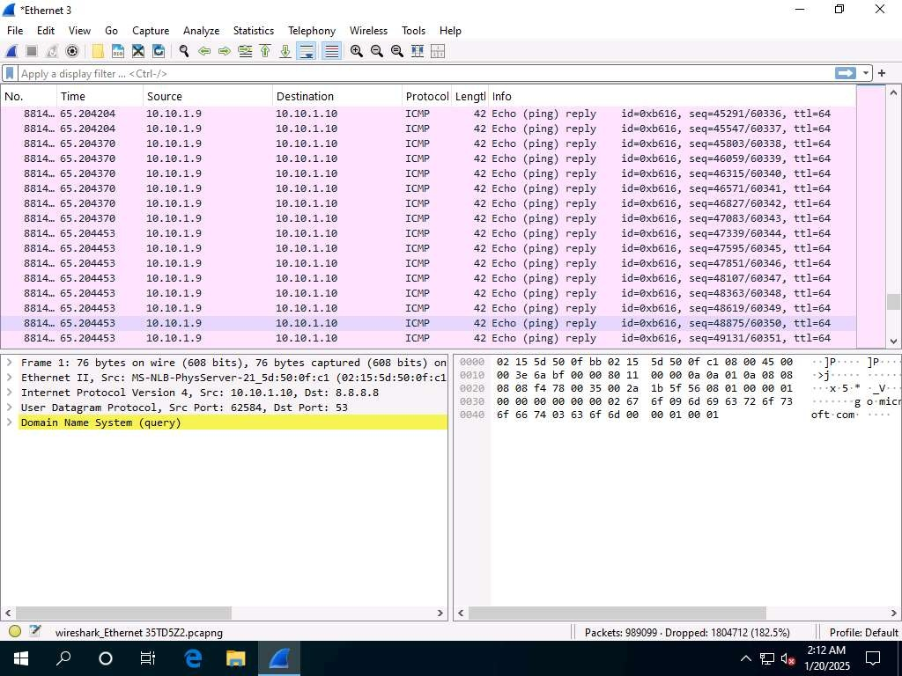

---

## Exercise 06: Demonstrating MAC Flooding and Packet Analysis with Wireshark

### Cenário
O *MAC Flooding* visa sobrecarregar a tabela CAM de um *switch*, gerando milhares de pacotes com endereços MAC e IP de origem forjados. Quando a tabela esgota a capacidade, o equipamento entra num estado de *fail-open*, passando a transmitir o tráfego recebido para todas as suas portas, o que facilita o *sniffing* por atacantes.

### Objetivo
Demonstrar a execução de um ataque de *MAC/ARP Flooding* utilizando a ferramenta `macof` e analisar os pacotes forjados através do Wireshark.

### Metodologia e Execução

1. **Inundação Genérica:**
   * Executou-se o comando de ataque no Kali: `sudo macof -i eth0`.
   * O Wireshark registou instantaneamente pacotes com MACs e IPs aleatórios.
2. **Inundação Direcionada:**
   * Executou-se uma variante direcionada a um alvo: `sudo macof -i eth0 -d 10.10.1.10`.
   * Utilizou-se o *Display Filter* `ip.addr==10.10.1.10` no Wireshark para isolar e analisar o tráfego da vítima.

### Análise e Conclusão
A análise demonstrou a assinatura de um ataque de *MAC Flooding* direcionado. Como documentado na imagem abaixo, observa-se uma inundação de pacotes destinados ao IP alvo, todos originados de endereços IP e MAC completamente forjados gerados pelo `macof`. Em ambientes corporativos, a mitigação passa pela implementação de *Port Security* e *Dynamic ARP Inspection* (DAI).

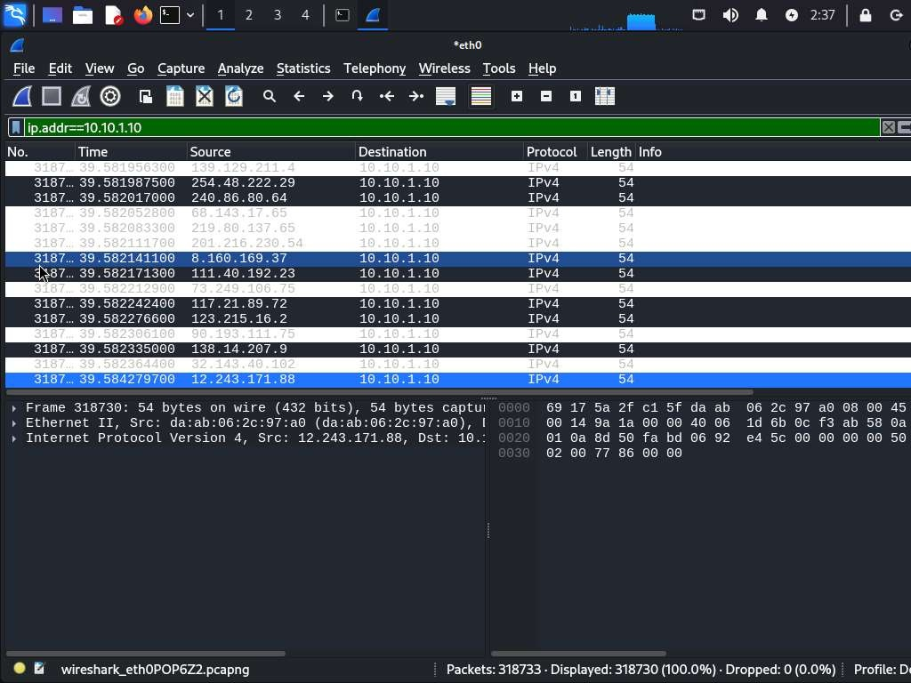

---

## Exercise 07: ARP Poisoning and Traffic Interception with Metasploit and Wireshark

### Cenário
O *ARP Poisoning* (ou *ARP Spoofing*) injeta mensagens ARP forjadas numa rede local para associar o endereço MAC do atacante ao endereço IP de um dispositivo legítimo. Esta técnica permite intercetar ou modificar tráfego (ataques *Man-in-the-Middle*).

### Objetivo
Demonstrar a execução de um ataque de *ARP Poisoning* utilizando o Metasploit Framework para intercetar tráfego de rede e analisar os indicadores de compromisso (IoCs) através do Wireshark.

### Metodologia e Execução

1. **Preparação do Ataque (Metasploit):**
   * Carregou-se o módulo: `use auxiliary/spoof/arp/arp_poisoning`.
   * Configuraram-se os parâmetros do ataque (`DHOSTS 10.10.1.10` e `SHOSTS 10.10.1.1`).
2. **Execução e Deteção de Anomalias:**
   * Executou-se o ataque com o comando `run`.
   * No Wireshark, acedeu-se a `Analyze` > `Expert Information` para rever os avisos gerados pelo analisador.

### Análise e Conclusão
O ataque gerou ruído identificável na rede, detetado pelo *Expert Information* do Wireshark, através de dois indicadores críticos (IoCs):
* **Connection Reset (RST):** Términos abruptos de sessões TCP (`[RST, ACK]`), resultantes da disrupção do tráfego legítimo.
* **DNS query retransmission:** Retransmissões anómalas de consultas DNS, indicando que os pedidos originais foram intercetados ou bloqueados.

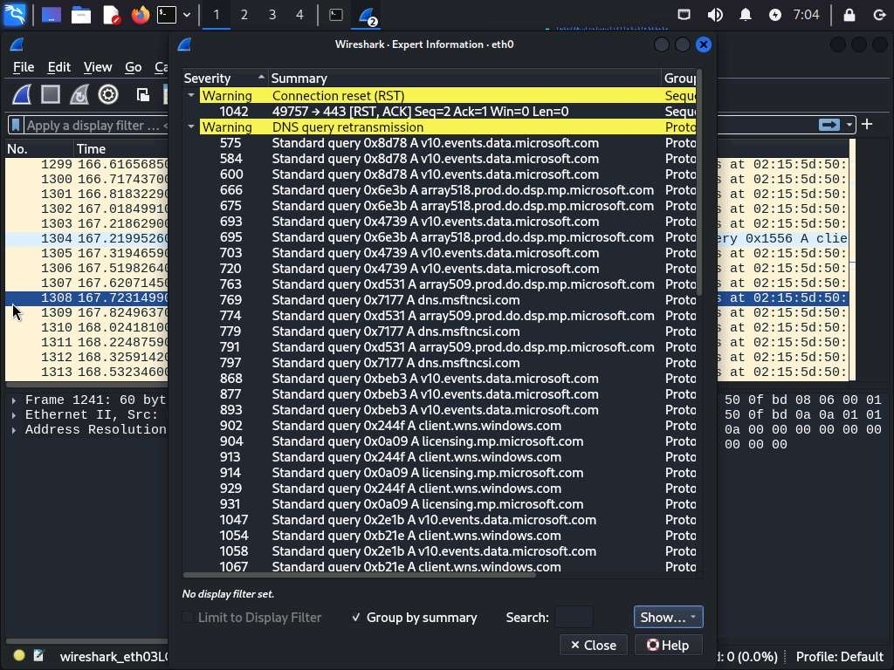
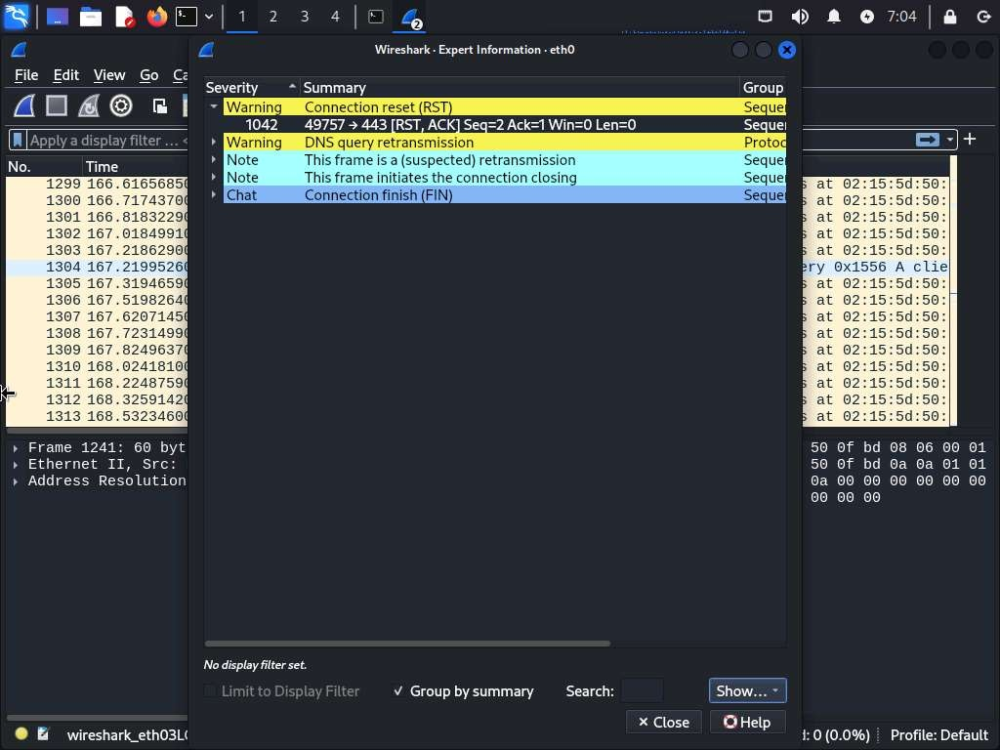

---

## Exercise 08: Analyzing Tor Network Traffic Using Wireshark and NetworkMiner

### Cenário
Embora o tráfego da rede Tor permaneça fortemente encriptado, a utilização conjunta do Wireshark (para análise de pacotes) e do NetworkMiner (para extração passiva de ficheiros e credenciais) permite reconstruir partes de sessões e identificar incidentes.

### Objetivo
Analisar e extrair evidências forenses de tráfego associado à rede Tor, utilizando o Wireshark e o NetworkMiner.

### Metodologia e Execução

1. **Análise no Wireshark:**
   * Identificou-se tráfego no porto **9150** (porto padrão do *Tor Browser*). O fluxo TCP confirmou a encriptação total do *payload*.
2. **Extração Forense (NetworkMiner):**
   * Carregou-se a captura no NetworkMiner, que organizou os dados e extraiu ficheiros automaticamente.
   * No separador **Files**, revelaram-se páginas web em texto limpo indicando pesquisas por documentação falsa.
   * Exploraram-se os separadores **Images** e **Credentials**.

### Análise e Conclusão
Enquanto o Wireshark confirmou a encriptação do túnel, o NetworkMiner provou ser indispensável na reconstrução automática de dados vazados. Como documentado abaixo, a ferramenta extraiu o acesso a domínios da *dark web* (`.onion`), *cookies* de sessão e até credenciais enviadas num formulário (`BadGuyTyrell`), o que corrobora o incidente sob investigação.

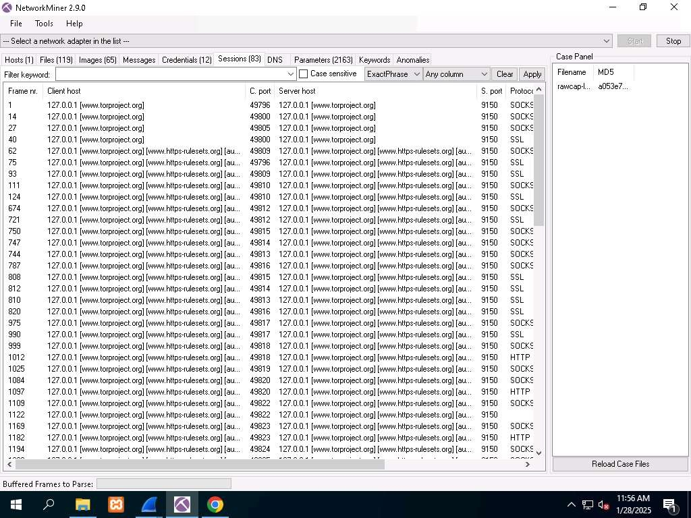
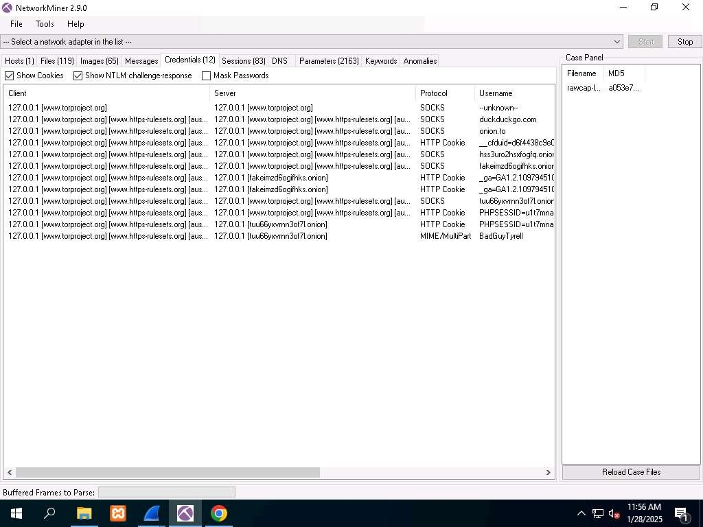

---

## Exercise 09: Analyzing FTP Brute-Force Attacks using Wireshark

### Cenário
Os ataques de força bruta a servidores FTP envolvem tentativas automatizadas de combinações de credenciais. A captura deste tráfego no Wireshark permite identificar padrões anómalos de *login* e verificar eventuais quebras de segurança.

### Objetivo
Capturar e analisar tráfego de rede para identificar uma tentativa de ataque de força bruta a um servidor FTP, utilizando o **Hydra** e o Wireshark.

### Metodologia e Execução

1. **Execução do Ataque:**
   * Utilizou-se o Hydra com dicionários de *usernames* e *passwords*:
     `hydra -L username.txt -P password.txt -vV 10.10.1.15 ftp`
2. **Análise de Tráfego:**
   * Aplicou-se o filtro `ftp` no Wireshark para isolar as comunicações em texto limpo do protocolo.

### Análise e Conclusão
O tráfego exibe dezenas de pedidos automatizados. A primeira imagem abaixo mostra a iteração contínua de nomes de utilizador através do comando `USER`. A segunda ilustra as sucessivas tentativas de palavras-passe através do comando `PASS`, seguidas das rejeições (`530 Login or password incorrect!`). Este laboratório comprova a vulnerabilidade de serviços FTP legados.

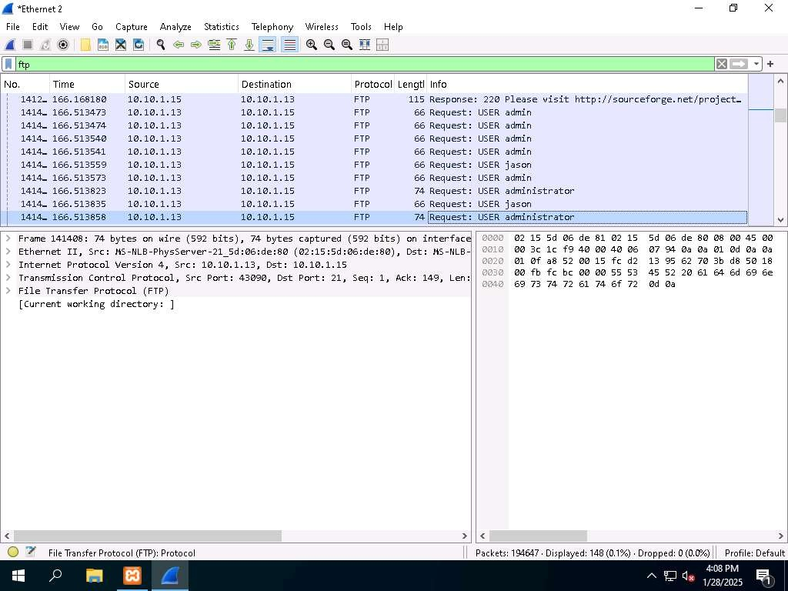
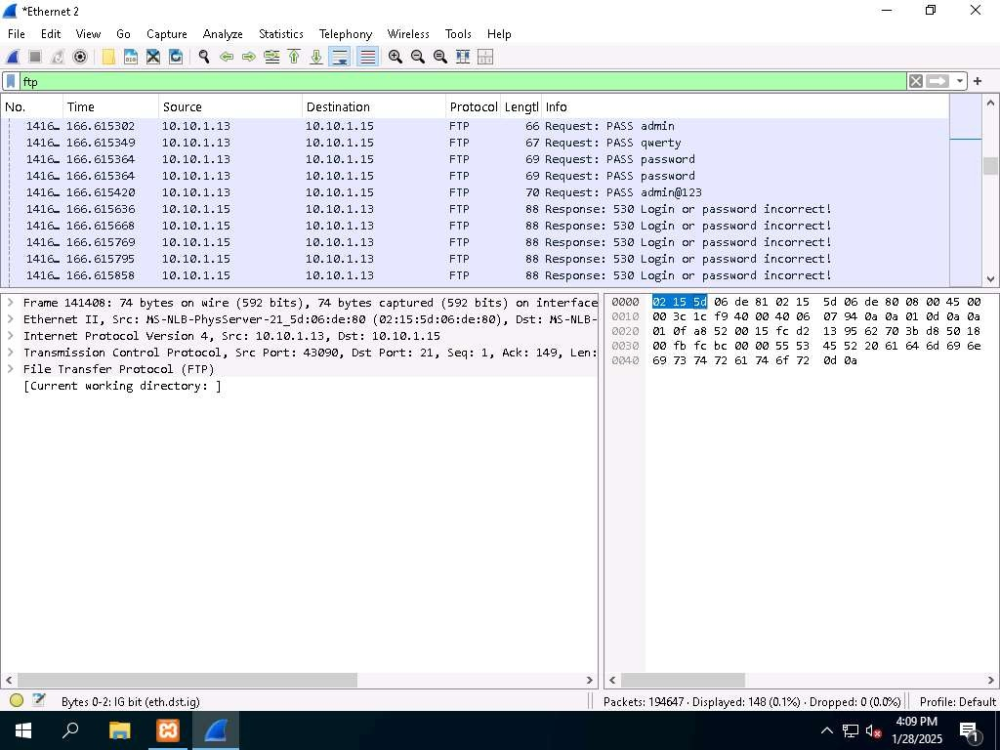

---

## Exercise 10: Analyzing Suspicious Network Traffic for Malicious Activity with Wireshark

### Cenário
Em atividades de *Threat Hunting*, a utilização de portos não standard e uma frequência elevada de *flags* PSH-ACK são indicadores de comportamento malicioso, como exfiltração de dados ou canais de Comando e Controlo (C2).

### Objetivo
Analisar tráfego de rede para identificar sinais de atividade suspeita e padrões de comunicação anormais.

### Metodologia e Execução

1. **Distribuição de Protocolos:** Acedeu-se a `Statistics` > `Protocol Hierarchy`. Identificou-se tráfego categorizado como **Data** (dados que o Wireshark não consegue dissecar num protocolo padrão).
2. **Filtragem:** Aplicou-se o filtro `data` diretamente a partir da hierarquia de protocolos.
3. **Inspeção de Assinaturas:** Analisou-se a comunicação resultante, observando portos e *flags* TCP.

### Análise e Conclusão
A aplicação do filtro `data` isolou um fluxo altamente suspeito a decorrer num porto não standard (`18067`), com utilização constante das *flags* `[PSH, ACK]`. A *flag* PSH força a passagem imediata de dados para a camada de aplicação, comportamento típico em sessões interativas (*reverse shells*) ou exfiltração em tempo real.

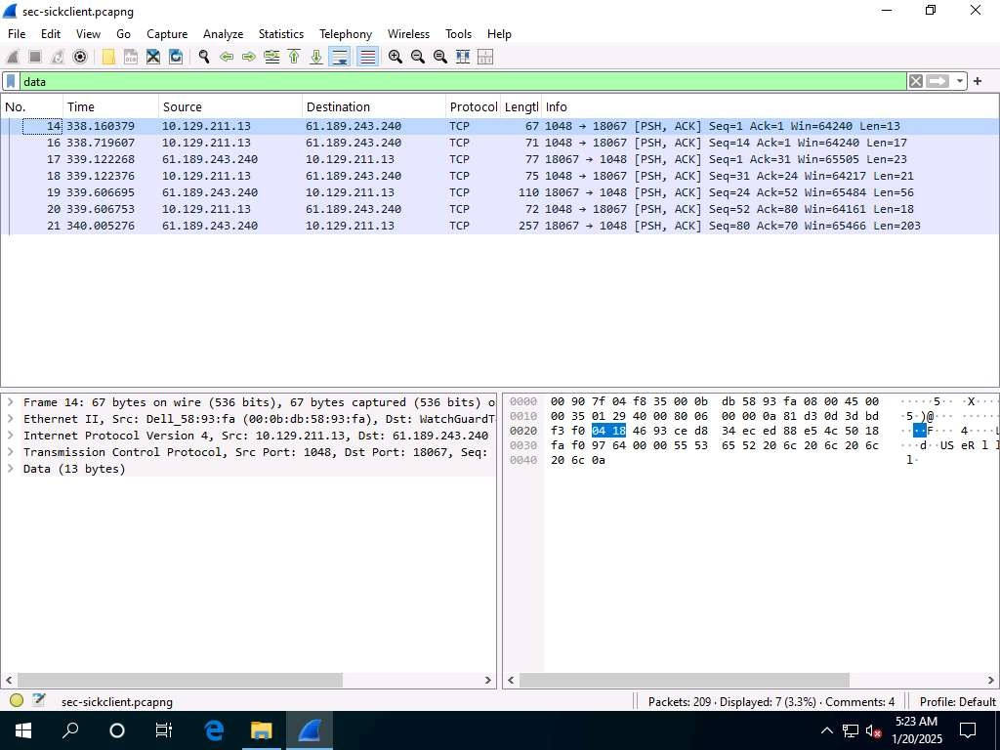

---

## Exercise 11: Conducting and Analyzing SYN Flood DOS Attack with Wireshark

### Cenário
O *SYN Flood* é um ataque DoS que explora o *three-way handshake* TCP. O atacante envia uma torrente de pacotes SYN, mas nunca completa o *handshake*, esgotando os recursos do servidor com ligações semiabertas. 

### Objetivo
Executar um ataque *SYN Flood* com o `hping3` e analisar o tráfego resultante com o Wireshark.

### Metodologia e Execução

1. **Execução do Ataque:**
   * Comando executado: `hping3 -c 15000 -d 120 -S -w 64 -p 80 --flood --rand-source 10.10.1.15`
   * O parâmetro `--rand-source` falsifica o endereço IP de origem para ofuscar o ataque.
2. **Análise de Tráfego:** Captura efetuada na máquina alvo para correlacionar parâmetros.

### Análise e Conclusão
A imagem documenta um volume massivo de captura (mais de 3 milhões de pacotes). O tráfego espelha os parâmetros injetados: *flag* `[SYN]`, janela de 64 bytes (`Win=64`), *payload* de 120 bytes (`Len=120`) e destino à porta 80. O campo *Source IP* revela uma constante mutação (endereços aleatórios forjados). Em cenários reais, a mitigação exige a implementação de *SYN Cookies*.

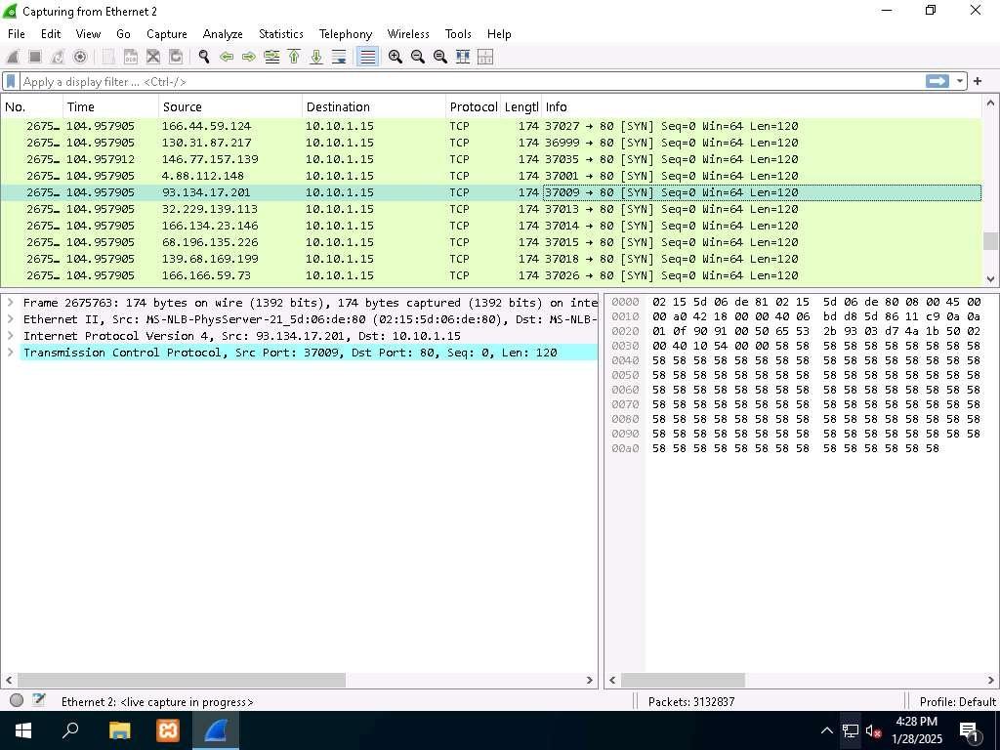

---

## Exercise 12: Detecting Botnet Activity Using Wireshark

### Cenário
Sistemas infetados por *botnets* efetuam varrimentos (ex: pacotes SYN para a porta 139) para reconhecimento. Para manterem contacto com os servidores C2, recorrem a técnicas como *Fast-Flux DNS*, reveladas por um volume anómalo de *Answer Resource Records* (RRs) nas respostas DNS.

### Objetivo
Analisar tráfego para identificar indicadores de compromisso (IoCs) de uma infeção por *botnet* focando em anomalias TCP e DNS.

### Metodologia e Execução

1. **Análise de Movimento Lateral (TCP):** Filtrou-se por `tcp` e detetou-se um *host* a enviar pacotes SYN à porta 139 (NetBIOS) de vários destinos (tentativa de propagação).
2. **Deteção *Fast-Flux* (DNS):**
   * Filtrou-se por `dns`.
   * Expandiu-se o painel `Domain Name System` nas respostas, observando-se a existência de múltiplos IPs para o mesmo domínio.
3. **Filtragem Avançada:** Aplicou-se o filtro `dns.count.answers > 4` para isolar automaticamente anomalias de resolução DNS.

### Análise e Conclusão
O filtro `dns.count.answers > 4` isolou as anomalias, revelando pacotes com 12 *Answer RRs* para um único domínio, denunciando o uso de *Fast-Flux DNS* por parte da *botnet* para evadir bloqueios convencionais. Esta competência analítica é crítica em operações de *Threat Hunting* contra ameaças avançadas (APTs).

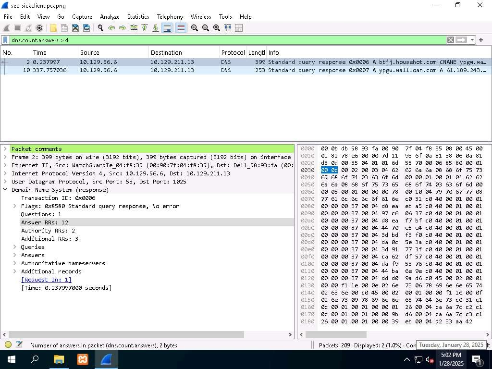
